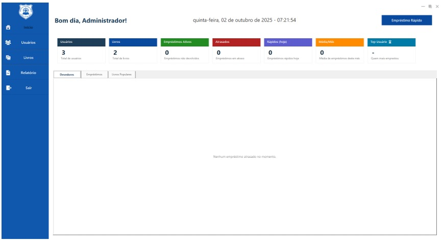

# School Library Management System

A free, open-source library management system built for public schools. Originally developed at **E. E. Professor Gastão Valle** (Bocaiúva, MG — Brazil), this project was recognized by the Minas Gerais State Department of Education as a standout in Educational Innovation.

This repository contains the **landing page and distribution site** for the desktop application, built with Next.js.

---

## About the Project

The School Library Management System was created to solve a real problem: many public schools in Brazil still manage their libraries manually with paper logs and spreadsheets. This system modernizes that process with a Windows desktop application that handles:

- **Student management** — register students with detailed info (email, phone, grade level) and browse them in an organized list.
- **Book catalog with barcode support** — register books using a USB barcode scanner. Categorize by subject, author, and publisher.
- **Loan control** — enforces a policy of 1 book per student for 1 week, ensuring fair access and book rotation.
- **Book reservations** — students can reserve popular titles in advance.
- **Notifications** — automatic alerts for due dates, overdue books, and reservation availability.

## Tech Stack

This landing page is built with:

| Layer | Technology |
|-------|-----------|
| Framework | [Next.js 15](https://nextjs.org/) (App Router) |
| Language | TypeScript |
| Styling | [Tailwind CSS 3](https://tailwindcss.com/) |
| Icons | [Lucide React](https://lucide.dev/) |
| Font | [Poppins](https://fonts.google.com/specimen/Poppins) (via `next/font`) |
| Utilities | clsx, tailwind-merge |

## Project Structure

```
src/
├── app/                    # Next.js App Router pages and layout
│   ├── layout.tsx          # Root layout with SEO metadata and structured data
│   ├── page.tsx            # Home page composing all sections
│   └── globals.css         # Global styles and CSS variables
├── components/
│   ├── layout/             # Header and Footer
│   ├── sections/           # Page sections (Hero, Features, Award, Download)
│   ├── ui/                 # Reusable UI primitives (Button, etc.)
│   └── AnalyticsClient.tsx # Client-side analytics tracking
├── domain/
│   ├── constants/          # App content and configuration
│   └── entities/           # TypeScript type definitions
└── lib/                    # Shared utilities
```

## Getting Started

### Prerequisites

- [Node.js](https://nodejs.org/) 18 or later
- npm (included with Node.js)

### Installation

```bash
git clone https://github.com/ArctisDev/school-library-app.git
cd school-library-app
npm install
```

### Development

```bash
npm run dev
```

The site will be available at [http://localhost:3000](http://localhost:3000).

### Production Build

```bash
npm run build
npm start
```

## Screenshots

The landing page showcases the desktop application with a real screenshot of the management dashboard:



## Recognition

This project was recognized by the **Secretaria de Educação de Minas Gerais** as an outstanding initiative in Educational Innovation (2025). It was highlighted for its impact in modernizing school management and encouraging reading habits among students at E. E. Professor Gastão Valle.

Read more: [Estudantes de escola estadual desenvolvem sistema para modernizar biblioteca](https://bh24horas.com.br/agencia-minas/estudantes-de-escola-estadual-desenvolvem-sistema-para-modernizar-biblioteca/)

## Contributing

Contributions are welcome. If you'd like to adapt this system for your school or improve the project:

1. Fork the repository
2. Create a feature branch (`git checkout -b feature/your-feature`)
3. Commit your changes (`git commit -m "Add your feature"`)
4. Push to the branch (`git push origin feature/your-feature`)
5. Open a Pull Request

## License

This project is licensed under the MIT License. See the [LICENSE](LICENSE) file for details.

---

Developed at [E. E. Professor Gastão Valle](https://www.gastaovalle.com/) — Bocaiúva, MG, Brazil.
